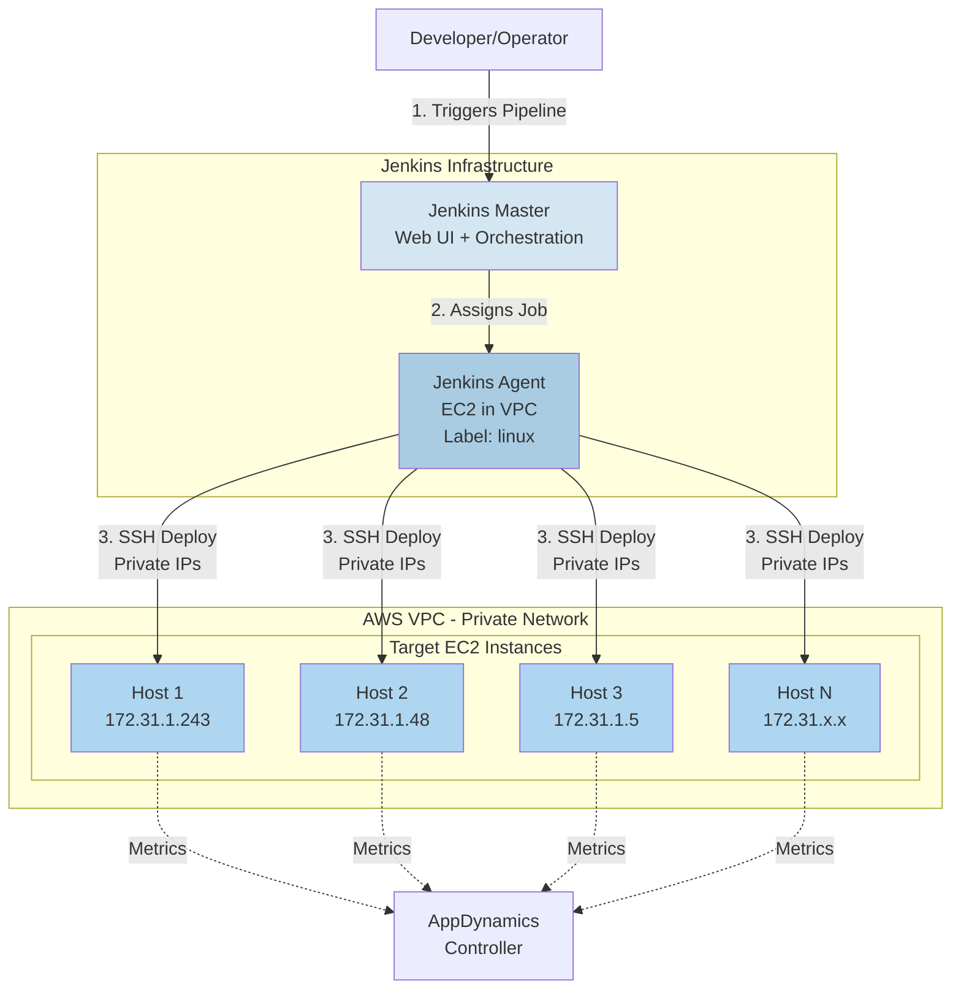
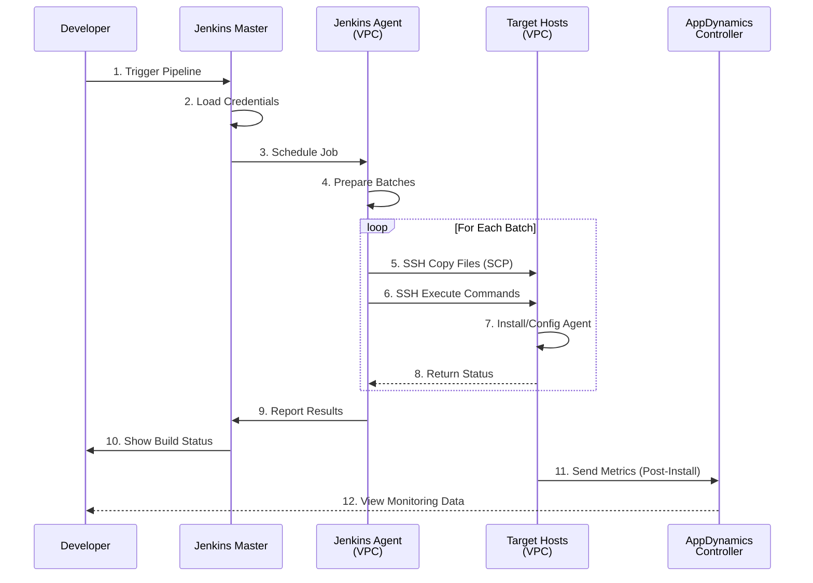
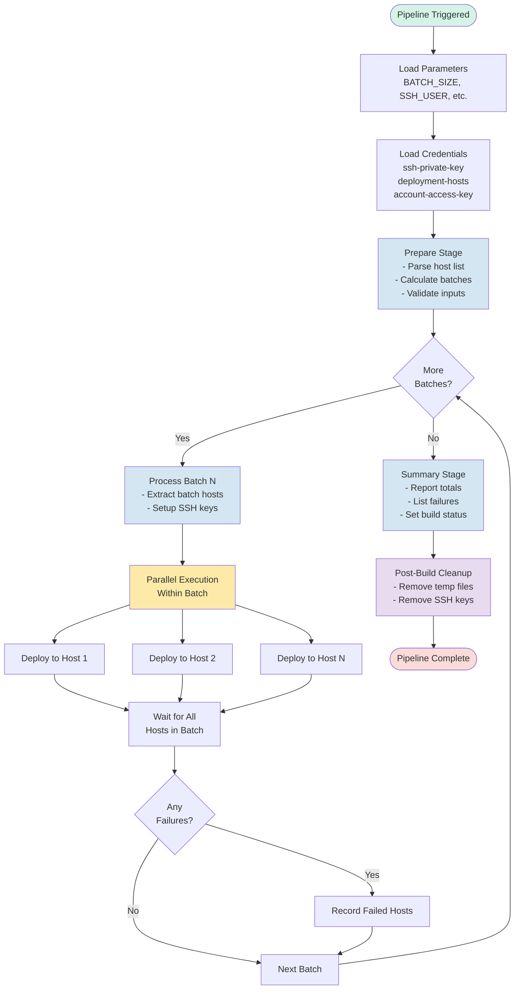
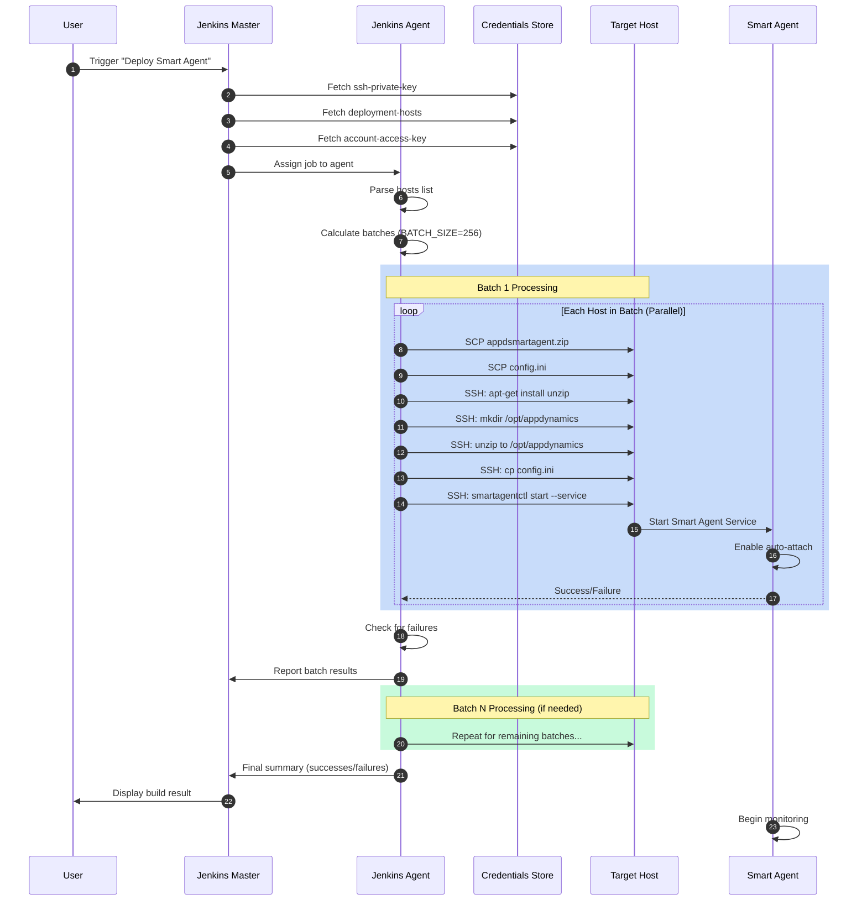
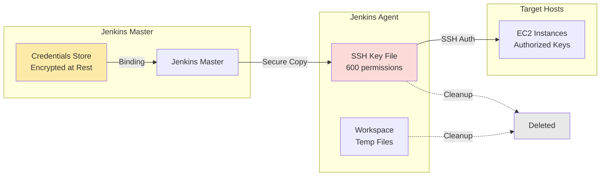
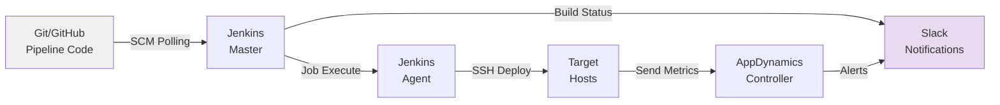

# Architecture Documentation

Complete architecture overview of the Jenkins-based AppDynamics Smart Agent management system.

## Table of Contents
- [System Overview](#system-overview)
- [Network Architecture](#network-architecture)
- [Pipeline Architecture](#pipeline-architecture)
- [Deployment Flow](#deployment-flow)
- [Component Details](#component-details)
- [Security Architecture](#security-architecture)

---

## System Overview



---

## Network Architecture

### VPC Layout

```
┌─────────────────────────────────────────────────────────────────┐
│                        AWS VPC (10.0.0.0/16)                    │
│  ┌───────────────────────────────────────────────────────────┐  │
│  │              Security Group: app-agents-sg                │  │
│  │  Rules:                                                   │  │
│  │  - Inbound: SSH (22) from Jenkins Agent only             │  │
│  │  - Outbound: HTTPS (443) to AppDynamics Controller       │  │
│  └───────────────────────────────────────────────────────────┘  │
│                                                                  │
│  ┌──────────────┐    ┌──────────────┐    ┌──────────────┐      │
│  │ Jenkins Agent│    │  Target EC2  │    │  Target EC2  │      │
│  │              │    │              │    │              │      │
│  │ Private IP:  │───▶│ Private IP:  │    │ Private IP:  │      │
│  │ 172.31.50.10 │SSH │ 172.31.1.243 │    │ 172.31.1.48  │      │
│  │              │───▶│              │    │              │      │
│  │ Label: linux │    │ Ubuntu 20.04 │    │ Ubuntu 20.04 │      │
│  └──────────────┘    └──────────────┘    └──────────────┘      │
│         │                    │                    │             │
│         │                    │                    │             │
│         └────────────────────┴────────────────────┘             │
│                              │                                  │
└──────────────────────────────┼──────────────────────────────────┘
                               │
                               ▼
                    ┌──────────────────┐
                    │   AppDynamics    │
                    │    Controller    │
                    │  (SaaS/On-Prem)  │
                    └──────────────────┘
```

### Network Flow



---

## Pipeline Architecture

### Jenkins Pipeline Structure



### Pipeline Types & Relationships

```
┌─────────────────────────────────────────────────────────────┐
│                    DEPLOYMENT PIPELINE                       │
│  01-deploy-smart-agent.jenkinsfile                          │
│  • Uploads Smart Agent package (19MB)                       │
│  • Uploads config.ini with access key                       │
│  • Installs and starts Smart Agent service                  │
│  • Enables auto-attach for agents                           │
└────────────────────────┬────────────────────────────────────┘
                         │
          ┌──────────────┴──────────────┐
          │                             │
          ▼                             ▼
┌─────────────────────┐       ┌─────────────────────┐
│  INSTALL PIPELINES  │       │   MANAGEMENT        │
│  (Lightweight)      │       │   PIPELINES         │
├─────────────────────┤       ├─────────────────────┤
│ 02-install-machine  │       │ 06-stop-clean       │
│ 03-install-java     │       │ 11-cleanup-all      │
│ 04-install-node     │       └─────────────────────┘
│ 05-install-db       │                 │
│                     │                 │
│ • SSH command only  │                 │
│ • Uses smartagentctl│                 │
│ • No file transfer  │                 │
└──────────┬──────────┘                 │
           │                            │
           ▼                            ▼
┌─────────────────────┐       ┌─────────────────────┐
│ UNINSTALL PIPELINES │       │   FINAL CLEANUP     │
│  (Lightweight)      │       └─────────────────────┘
├─────────────────────┤
│ 07-uninstall-machine│
│ 08-uninstall-java   │
│ 09-uninstall-node   │
│ 10-uninstall-db     │
│                     │
│ • SSH command only  │
│ • Uses smartagentctl│
└─────────────────────┘
```

---

## Deployment Flow

### Complete Deployment Sequence



### Batch Processing Details

```
HOST LIST (1000 hosts)              BATCH_SIZE = 256
─────────────────────
Host 001: 172.31.1.1                ┌──────────────────┐
Host 002: 172.31.1.2      ────────▶ │   BATCH 1        │
    ...                              │   Hosts 1-256    │ ───┐
Host 256: 172.31.1.256               │   Sequential     │    │
                                     └──────────────────┘    │
Host 257: 172.31.1.257               ┌──────────────────┐    │
Host 258: 172.31.1.258   ────────▶  │   BATCH 2        │    │ SEQUENTIAL
    ...                              │   Hosts 257-512  │    │ EXECUTION
Host 512: 172.31.1.512               │   Sequential     │    │
                                     └──────────────────┘    │
Host 513: 172.31.1.513               ┌──────────────────┐    │
    ...                              │   BATCH 3        │    │
Host 768: 172.31.1.768   ────────▶  │   Hosts 513-768  │ ───┘
                                     └──────────────────┘
Host 769: 172.31.1.769               ┌──────────────────┐
    ...                              │   BATCH 4        │
Host 1000: 172.31.2.232  ────────▶  │   Hosts 769-1000 │
                                     │   (232 hosts)    │
                                     └──────────────────┘

WITHIN EACH BATCH:
┌────────────────────────────────────────┐
│  All hosts deploy in PARALLEL          │
│                                        │
│  Host 1 ──┐                           │
│  Host 2 ──┤                           │
│  Host 3 ──┼─▶ Background processes (&)│
│    ...    │                           │
│  Host 256─┘   └─▶ wait command        │
└────────────────────────────────────────┘
```

---

## Component Details

### Jenkins Master
```
┌─────────────────────────────────┐
│      Jenkins Master Server      │
├─────────────────────────────────┤
│ Responsibilities:               │
│ • Web UI for users              │
│ • Pipeline orchestration        │
│ • Credential management         │
│ • Build history & logs          │
│ • Job scheduling                │
│                                 │
│ Requirements:                   │
│ • Jenkins 2.300+                │
│ • Plugins: Pipeline, SSH Agent  │
│ • Network access to agent       │
└─────────────────────────────────┘
```

### Jenkins Agent
```
┌─────────────────────────────────┐
│     Jenkins Agent (EC2)         │
├─────────────────────────────────┤
│ Location:                       │
│ • AWS VPC (same as targets)     │
│ • Private network access        │
│                                 │
│ Responsibilities:               │
│ • Execute pipeline stages       │
│ • SSH to target hosts           │
│ • File transfers (SCP)          │
│ • Batching logic                │
│ • Error collection              │
│                                 │
│ Requirements:                   │
│ • Label: linux                  │
│ • Java 11+                      │
│ • SSH client                    │
│ • Network: SSH to all targets   │
│ • Disk: ~20GB for artifacts     │
└─────────────────────────────────┘
```

### Target Hosts
```
┌─────────────────────────────────┐
│       Target EC2 Instance       │
├─────────────────────────────────┤
│ Pre-requisites:                 │
│ • Ubuntu 20.04+                 │
│ • SSH server running            │
│ • User with sudo access         │
│ • Authorized SSH key            │
│                                 │
│ Post-deployment:                │
│ • /opt/appdynamics/             │
│   └── appdsmartagent/           │
│       ├── smartagentctl         │
│       ├── config.ini             │
│       └── agents/               │
│           ├── machine/          │
│           ├── java/             │
│           ├── node/             │
│           └── db/               │
│                                 │
│ Services:                       │
│ • appdsmartagent.service        │
└─────────────────────────────────┘
```

### Data Flow (Deployment)
```
Jenkins Master                Jenkins Agent               Target Host
──────────────                ─────────────               ───────────
[Credentials]                 [Workspace]                 [/tmp]
     │                             │                          │
     │  1. Load secrets            │                          │
     ├────────────────────────────▶│                          │
     │                             │                          │
     │                             │  2. Copy package         │
     │                             ├─────────────────────────▶│
     │                             │  (SCP 19MB)              │
     │                             │                          │
     │                             │  3. Copy config          │
     │                             ├─────────────────────────▶│
     │                             │  (SCP <1KB)              │
     │                             │                          │
     │                             │  4. Execute commands     │
     │                             ├─────────────────────────▶│
     │                             │  (SSH)                   │
     │                             │                          │
     │                             │                          │  [Install]
     │                             │                          │  [Configure]
     │                             │                          │  [Start Service]
     │                             │                          │
     │                             │  5. Return status        │
     │                             │◀─────────────────────────┤
     │                             │                          │
     │  6. Report results          │                          │
     │◀────────────────────────────┤                          │
     │                             │                          │
```

---

## Security Architecture

### Credential Flow



### Network Security

```
┌─────────────────────────────────────────────────────────┐
│                    Security Layers                       │
├─────────────────────────────────────────────────────────┤
│                                                          │
│  1. AWS VPC Isolation                                   │
│     • Private subnet for agents                         │
│     • No direct internet access required                │
│     • VPC flow logs enabled                             │
│                                                          │
│  2. Security Groups                                      │
│     • Whitelist Jenkins Agent IP                        │
│     • Port 22 (SSH) only                                │
│     • Stateful firewall rules                           │
│                                                          │
│  3. SSH Key Authentication                               │
│     • No password authentication                        │
│     • Keys stored in Jenkins credentials                │
│     • Temporary key files (600 perms)                   │
│     • Keys removed after each build                     │
│                                                          │
│  4. Jenkins RBAC                                         │
│     • Role-based access control                         │
│     • Pipeline-level permissions                        │
│     • Credential access restrictions                    │
│     • Audit logging enabled                             │
│                                                          │
│  5. Secrets Management                                   │
│     • No secrets in code/logs                           │
│     • Credentials binding only                          │
│     • Environment variable masking                      │
│     • Automatic secret rotation (optional)              │
│                                                          │
└─────────────────────────────────────────────────────────┘
```

### Threat Model & Mitigations

| Threat | Mitigation |
|--------|-----------|
| SSH key compromise | Keys stored encrypted in Jenkins, temporary files deleted |
| Man-in-the-middle | SSH host key verification (can be enabled) |
| Unauthorized access | Jenkins authentication + RBAC |
| Credential leakage | Secrets masked in logs, no echo commands |
| Network sniffing | All traffic within private VPC |
| Privilege escalation | Sudo access required and audited |
| Denial of service | Batch size limits, sequential processing |

---

## Scalability & Performance

### Scaling Characteristics

```
┌────────────────────────────────────────────────────────┐
│              Performance Metrics                        │
├────────────────────────────────────────────────────────┤
│                                                         │
│  Deployment Speed (default BATCH_SIZE=256):            │
│                                                         │
│    10 hosts    →  1 batch  →  ~2 minutes               │
│   100 hosts    →  1 batch  →  ~3 minutes               │
│   500 hosts    →  2 batches → ~6 minutes               │
│  1,000 hosts   →  4 batches → ~12 minutes              │
│  5,000 hosts   →  20 batches → ~60 minutes             │
│                                                         │
│  Factors:                                               │
│  • Network bandwidth (19MB package per host)           │
│  • SSH connection overhead (~1s per host)              │
│  • Target host CPU/disk speed                          │
│  • Jenkins agent resources                             │
│                                                         │
│  Tuning:                                                │
│  • Increase BATCH_SIZE for faster network              │
│  • Decrease BATCH_SIZE if agent overwhelmed            │
│  • Multiple agents for different regions               │
│                                                         │
└────────────────────────────────────────────────────────┘
```

### Resource Requirements

| Component | CPU | Memory | Disk | Network |
|-----------|-----|--------|------|---------|
| Jenkins Master | 2 cores | 4 GB | 50 GB | 100 Mbps |
| Jenkins Agent | 4 cores | 8 GB | 100 GB | 1 Gbps |
| Target Host | 1 core | 2 GB | 20 GB | 100 Mbps |

---

## Disaster Recovery

### Failure Scenarios

```
SCENARIO 1: Single Host Failure
────────────────────────────────
Host 245 in Batch 1 fails
    │
    ├─▶ Error recorded in FAIL_FILE
    ├─▶ Other 255 hosts in batch continue
    ├─▶ Subsequent batches proceed
    └─▶ Summary lists failed host

RECOVERY: Re-run pipeline with single-host credential


SCENARIO 2: Batch Failure (Network)
────────────────────────────────────
Network issue affects entire batch
    │
    ├─▶ All hosts in batch recorded as failed
    ├─▶ Subsequent batches NOT attempted
    └─▶ Pipeline marked as FAILED

RECOVERY: Fix network, re-run pipeline (idempotent)


SCENARIO 3: Jenkins Agent Failure
──────────────────────────────────
Agent crashes mid-deployment
    │
    ├─▶ Partial batch may be deployed
    ├─▶ Pipeline marked as FAILED
    └─▶ No state saved

RECOVERY: Check partial deployments, re-run pipeline
```

### Rollback Procedures

```
ROLLBACK OPTION 1: Stop and Clean
──────────────────────────────────
Run: 06-stop-clean-smartagent.jenkinsfile
• Stops all Smart Agent services
• Cleans agent data directories
• Preserves installation for restart


ROLLBACK OPTION 2: Complete Removal
────────────────────────────────────
Run: 11-cleanup-all-agents.jenkinsfile
• Deletes /opt/appdynamics directory
• Removes all agents completely
• Requires full redeployment


ROLLBACK OPTION 3: Selective Uninstall
───────────────────────────────────────
Run: 07-10-uninstall-*.jenkinsfile
• Removes specific agent types
• Keeps Smart Agent running
• Allows reinstall of different versions
```

---

## Monitoring & Observability

### Pipeline Metrics

```
Jenkins Build Metrics:
• Build duration
• Success/failure rate
• Failed host count
• Batch completion time
• Agent resource usage

AppDynamics Metrics:
• Agent connectivity
• Metric collection rate
• Agent version distribution
• Host coverage percentage
```

### Logging

```
LOG LEVELS                 LOCATION
──────────────────────────────────────────────
Jenkins Console Output  →  Jenkins UI
Agent System Logs       →  /var/log/jenkins/
Target Host SSH Logs    →  /var/log/auth.log
Smart Agent Logs        →  /opt/appdynamics/appdsmartagent/logs/
AppDynamics Controller  →  Controller UI
```

---

## Integration Points



---

---

## References

- Jenkins Documentation: https://www.jenkins.io/doc/
- AppDynamics Smart Agent: https://docs.appdynamics.com/
- AWS VPC Best Practices: https://docs.aws.amazon.com/vpc/
- SSH Security: https://www.ssh.com/academy/ssh/security

---

**Last Updated**: November 2024  
**Version**: 1.0.0
